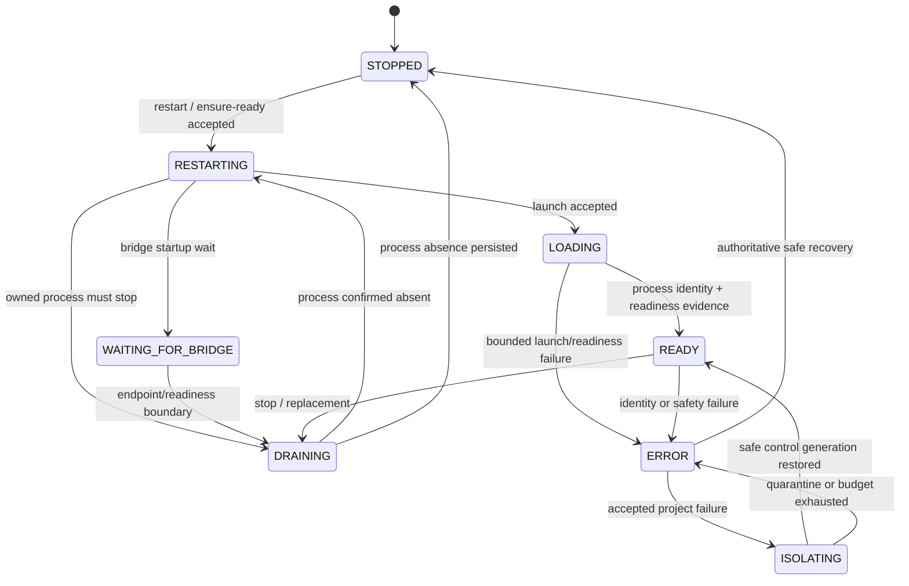

# DevBridge2 architecture

DevBridge2 is split into a transport-independent Coordinator Core, a small executable host, an
offline executable test suite, and two net472 components that are deliberately independent of the
net8 coordinator runtime.

```text
CLI / agents
    |
    | Coordinator IPC v2: request -> events* -> one terminal result
    v
Coordinator host (named pipe, current-user boundary, process startup)
    |
    v
Coordinator.Core (authoritative state, lifecycle, leases, persistence, recovery, routing)
    |                         |
    |                         +--> Runtime/state.json and immutable generation artifacts
    v
RimWorld process <---- readiness / process identity ---- DevBridge2 Mod (net472)
    |
    +---- optional loopback GABP ---- RimBridgeServer + optional BridgeTools companion
```

## Ownership and identity

One coordinator owns the configured coordinator root, its runtime slot, `Runtime/state.json`, leases,
the RimWorld process identity, accepted generations, and ModsConfig transitions. The executable host
serializes requests through a Windows named pipe restricted to the current user. A process cannot
become coordinator-owned merely by having the same PID: ownership requires the durable root/slot,
PID, process-start identity, launch ID, generation, and readiness evidence to agree.

The root path is canonicalized independently from opaque identifiers. The runtime slot is a stable
96-bit hash-derived ID; pipe and mutex names use the same canonical namespace rules. A persisted legacy
short slot is rejected with migration guidance rather than silently rebound. Full lease, registration,
scope-ticket, launch-key, and request identifiers are used for authorization and equality; short
prefixes are display-only.

Leases are durable, owner/session-bound records. The lease ID and stable agent identity authorize
renew/end/stop/ensure-ready operations. Connected test sessions renew only while connected. Expiry,
disconnect, and restart recovery never transfer authorization to another owner.

## IPC and command lifetime

The coordinator IPC contract is `devbridge-coordinator-ipc/v2`, sourced from
`DevBridgeSchemaVersions.CoordinatorProtocolMajor`. A request has a protocol version, request ID,
type, command, and bounded arguments. Events carry the same request ID and are distinct from a result.
Every finite accepted command produces exactly one terminal result. `wait-ready`, restart progress, and
test sessions may remain connected and emit events, but they still have explicit session semantics;
clients never wait for a magic substring in arbitrary output. Version, correlation, frame, command,
argument, and output limits are enforced before state mutation.

The machine-facing agent surface is separate from the legacy JSON response and uses four versioned
contracts: `devbridge-agent-capabilities/v1`, `devbridge-agent-snapshot/v1`,
`devbridge-agent-delta/v1`, and `devbridge-agent-event/v1`. The commands are
`agent capabilities --json`, `agent snapshot --json`, `agent delta --epoch <epoch> --since-seq <n> --json`,
and `agent wait-event --epoch <epoch> --since-seq <n> [--until <condition>] [--timeout-seconds <n>] --json`.
The delta cursor is `(epoch, sequence)`. Each coordinator process creates and durably records a fresh
epoch, starts sequence numbering at zero, and clears the 128-entry field-level ring journal. A cursor
from another epoch, ahead of the current sequence, or older than the retained ring fails closed; clients
must take a new snapshot. A successful delta aggregates the latest value for each changed field and does
not expose raw logs, diagnostics, endpoint host/port, or tokens. Snapshot projects, evidence, errors,
identities, and event output are bounded; wait-event defaults to 30 seconds and is capped at five minutes.
The journal is updated only during successful durable state replacement, so diagnostic trace activity does
not advance the agent sequence. Durable replacement pulses the existing coordinator gate, allowing
wait-event and legacy state waiters to wake without a polling loop.

For the same state transition, polling requires one request and response per snapshot interval (for example,
ten polls over ten seconds means 10 requests plus 10 snapshot responses). Wait-event requires one bounded
request and one terminal response, regardless of how long it remains pending; the pending response is not
written until a matching change, condition, timeout, shutdown, or disconnect occurs. Both use the existing
IPC v2 frame limits; the agent projection is deliberately much smaller than the legacy response.

## Lease-safe game primitives

`agent capabilities --json` is the single discovery surface for the low-level game primitive set. Its
`gamePrimitives` object uses `devbridge-game-primitives/v1`, declares `leaseRequired: true`, and lists
the supported `game` operations. There is no second discovery registry and no Frontier scenario encoded
in DevBridge2.

The command shapes are:

```text
DevBridge.cmd game inspect <tool-name> [JSON object] [--lease <lease-id>] --json
DevBridge.cmd game action <tool-name> [JSON object] [--lease <lease-id>] --json
DevBridge.cmd game wait <tool-name> [JSON object] --path <JSON pointer> --equals <JSON value> --timeout-ms <n> [--poll-ms <n>] [--lease <lease-id>] --json
DevBridge.cmd game advance --ticks <n> [--timeout-ms <n>] [--poll-ms <n>] [--lease <lease-id>] --json
DevBridge.cmd game save --name <save-name> [--timeout-ms <n>] [--lease <lease-id>] --json
DevBridge.cmd game load --name <save-name> [--readiness <gameData|mapData|currentMap|playable|visual>] [--timeout-ms <n>] [--poll-ms <n>] [--ignore-mod-compatibility] [--lease <lease-id>] --json
DevBridge.cmd game errors checkpoint [--lease <lease-id>] --json
DevBridge.cmd game errors delta --checkpoint <token> [--lease <lease-id>] --json
```

`inspect` and `action` forward caller-selected semantic RimBridge tools. `wait` polls a JSON-pointer
condition with a required timeout capped at five minutes and returns `GAME_WAIT_TIMEOUT`, attempts,
elapsed time, and the last result when it expires. `advance` uses `rimworld/step_game_ticks`; `save`
uses `rimworld/save_game` followed by `rimbridge/wait_for_long_event_idle`; and `load` uses
`rimworld/load_game_ready`, so completion is represented by a terminal semantic result rather than a
fixed sleep. Every result has explicit `success`, `exitCode`, `errorCode`/`error` on failure, and the
redacted generation/launch/PID route evidence.

The error checkpoint is a generation- and launch-bound sequence token returned by
`game errors checkpoint`. `errors delta` passes its sequence to `rimbridge/list_logs` and returns only
new sequence-numbered error entries, with a `nextCheckpoint` for continued collection. A stale token
fails with `GAME_ERROR_CHECKPOINT_STALE`; old errors are not treated as scenario errors.

All live calls still pass the existing generation, process-identity, endpoint, policy, and lease checks.
Without a valid lease the result is `RIMBRIDGE_LEASE_REQUIRED`; no testing bypass or implicit ownership
is added. A caller may use `--args <JSON object>` when shell quoting makes a JSON argument inconvenient.

These primitives prove the DevBridge side of a lifecycle, but they do not create Frontier semantics.
For the Frontier proving flow, Frontier must register stable RimBridge capabilities for a structured
Frontier state query and a caller-parameterized progression/action invocation (including an expedition or
equivalent transition), with responses that expose the state fields a caller can observe before and after
the action and after reload. The current Frontier build registers no such capability, so DevBridge2 does
not use coordinate clicks, screenshots, or Frontier-specific action IDs to fake that contract.

Autonomous test recipes are repository-owned files under `TestRecipes/`. `devbridge-test-recipe/v1`
retains its strict read-only contract: project aliases, typed generation inputs, readiness/Quicktest
and companion evidence requirements, bounded budgets, and policy-approved read-only RimBridge calls.
V1 does not acquire a new mutation meaning. Shell commands, arbitrary argv or environment values,
filesystem writes, profile mutation, and RimWorld lifecycle tools are not recipe concepts. Discovery
uses `test recipe list|show|plan`; `agent plan --recipe <id>` returns the versioned
`devbridge-agent-plan/v1` projection without acquiring a lease, registering intent, saving state,
restarting, writing ModsConfig, or calling RimBridge. The planner reuses project/profile resolution
and frozen-generation evidence, so an already-satisfied recipe reports zero estimated launches.

`devbridge-test-recipe/v2` adds a deliberately smaller behavioral-fixture contract. A recipe must set
`allowInGameMutation: true` before it may include policy-classified in-game tools, and each operation
may declare expected success plus bounded JSON-pointer assertions (`exists`, scalar `equals`,
`greaterThan`, or `lessThan`). For example:

```json
{
  "schemaVersion": "devbridge-test-recipe/v2",
  "id": "fixture-smoke",
  "allowInGameMutation": true,
  "requiresReady": true,
  "operations": [
    { "tool": "rimworld/fixture_mutate", "arguments": { "value": "ok" },
      "expect": { "success": true, "assertions": [
        { "pointer": "/value", "equals": "ok" }
      ] } }
  ]
}
```

Every routed operation still passes the normal RimBridge generation, process, endpoint, policy, and
lease checks. Behavioral recipes may mutate only temporary in-game test state under a valid DevBridge
lease; profile/ModsConfig and RimWorld lifecycle mutation remain unconditionally DevBridge-owned and
are rejected. Plans remain mutation-free, budgets bound time, operations, launches, attempts, refreshes,
and repeated failures, and credentials are never stored in recipes or evidence.

`test recipe run <id>` is a bounded coordinator operation. Caller timeout, launch, attempt, refresh,
and repeated-failure limits are intersected with stricter coordinator limits. A run joins compatible
accepted restart work through the existing launch-owner/frozen-generation rules, requests at most one
replacement launch, uses the existing test-lease and RimBridge policy boundaries, and returns a compact
versioned result with consumed budget, generation, evidence reference, failure fingerprint, and the
next safe action. Lease and temporary registration cleanup is ownership-checked; an accepted pending
restart is left durable for recovery when the caller budget expires. Recipe-run IPC is classified as
long-running, while list/show/plan remain finite.

Lease precondition refusals such as `RECIPE_SUPPLIED_LEASE_NOT_HELD`,
`RECIPE_SUPPLIED_LEASE_GENERATION_MISMATCH`, and `RECIPE_SUPPLIED_LEASE_REQUIRES_READY` are retained as
bounded evidence for diagnosis, but are not eligible to short-circuit a later recipe as an autonomous
repeated failure: no recipe operation was attempted. Actual recipe, readiness, and lifecycle failures
remain protected by the repeated-failure fingerprint guard. Legacy summaries recover this classification
from their evidence record when the persisted summary predates the `errorCode` field.

The RimBridge client has a separate typed GABP boundary. Its contract and tested surface are in
[`RimBridgeProtocolCompatibility.json`](../RimBridgeProtocolCompatibility.json): `gabp/1`, typed
`session/hello`, `tools/list`, `tools/call`, bounded Content-Length framing, exact response IDs, and
redacted error mappings. No live RimBridgeServer version is claimed without a local smoke test.

## Lifecycle and generations

The durable lifecycle state is represented by `STOPPED`, `RESTARTING`, `WAITING_FOR_BRIDGE`, `DRAINING`,
`LOADING`, `READY`, `ISOLATING`, and `ERROR`. The simplified transition graph is:



An accepted generation freezes the exact profile, ModsConfig fingerprints, project registrations,
launch identity, process evidence, and readiness evidence. Generation numbers never decrease. Accepted
history and manifests are immutable evidence; later STOPPED or failure records do not rewrite a
completed accepted generation. A replacement launch cannot silently consume another owner's lease or
replenish a finite launch/isolation budget.

For a deterministic configuration-versus-failure investigation, use `history`, then
`history diagnose <failed-generation>`. The diagnosis compares the failed generation with the nearest
prior valid READY generation and attaches only bounded normalized evidence. Follow an evidence reference
with `evidence show <id>`, and use `logs query ...` when launch-bound log evidence is still available.
The diff separates semantic profile/build changes from runtime identity changes such as PID and launch ID;
it reports added packages as facts, not as proof of causality.

## Durable state and authority boundaries

State and semantic history are written atomically under `Runtime`. Important artifacts include
`state.json`, baseline/generated ModsConfig records, generation manifests/history, readiness and
quicktest failure evidence, endpoint metadata, and bounded `coordinator-events.jsonl` diagnostics.
Writes use temporary files and replacement, and recovery distinguishes a missing write, a completed
replacement, and an ambiguous side effect. Diagnostic failures never trigger an unsafe fallback.

DevBridge is the sole authority for its generated `ModsConfig.xml`, accepted profiles, baselines,
generation ownership, and lifecycle. Unexpected external edits are recorded as evidence and fail closed;
the coordinator does not bless the changed bytes or enter an automatic restart loop. Explicit baseline
capture/restore and profile workflows are required to reconcile ownership.

RimWorld process control is identity-bound. PID alone is insufficient; process start identity, launch
ID, generation, configured root, and readiness evidence must match. If the census is ambiguous, the
coordinator preserves quarantine. A proven empty census may persist STOPPED, but a separate explicit
restart is required.

## Recovery and crash isolation

Coordinator restart loads durable state and resumes only operations whose safety evidence is complete.
Uncertainty never becomes permission to kill or launch. Fault boundaries around state writes, atomic
replacement, process actions, ModsConfig transitions, history/manifest writes, result writes, and
shutdown are tested with deterministic injection. Recovery is bounded and idempotent.

When a project failure is attributable and the accepted aggregate is safe to test, crash isolation
freezes the accepted evidence, tries bounded control-profile candidates, and restores the maximal safe
remainder. Control failures, stale process identity, ambiguous side effects, malformed failure data,
and exhausted budgets are environmental/quarantined outcomes, not invitations to retry indefinitely.

## RimBridge trust boundary and secrets

RimBridgeServer remains an optional live-game observation/control service. DevBridge routes only after
validating the current generation, process identity, loopback endpoint, policy, lease, and optional
companion identity. The companion is read-only and strengthens identity evidence; endpoint-only
operation remains valid when it is absent. The core Mod has no RimBridgeServer SDK dependency.

Tokens and authorization secrets are never persisted in ordinary state, status, doctor, provenance,
trace, or release manifests. Error text and opaque evidence use bounded redaction. Raw environment
variables, arbitrary tool payloads, and host SDK assemblies are not release diagnostics or package
inputs.

## Development planning and publication

`scripts/dev-plan.ps1` is the source-aware development planner. It accepts
`-ChangedSince <git-ref>` or an explicit `-ChangedFile` list and emits both a
human summary and `devbridge-build-plan/v1` JSON. Classification follows the
actual project graph: Coordinator.Core changes normally build the Coordinator
host, the three Core files linked by the mod also require `DevBridge2.dll`,
BridgeTools uses the existing companion project, and docs/tests/recipes do not
trigger runtime binary builds. `scripts/dev-plan.tests.ps1` locks the minimal
build/deploy/restart matrix, including mixed changes.

`scripts/dev-publish.ps1` consumes or recomputes that plan. It builds only the
selected projects, compares SHA-256 bytes before every deployment, replaces
coordinator artifacts only after `coordinator shutdown`, and deploys BridgeTools
through the existing canonical sibling path used by `Publish-DevBridge.ps1`.
Hash-identical output is a no-op. Mod assemblies and RimWorld content report a
RimWorld restart requirement; a copied file never proves that code already
loaded in RimWorld. BridgeTools live reload is intentionally reported as
unknown unless a supported host signal exists. `scripts/dev-publish.tests.ps1`
covers identical coordinator output, changed coordinator graceful refresh,
changed mod restart/loaded-code uncertainty, and canonical companion placement.

The coordinator remains a runtime authority, not a build service. `agent
build-plan --json` is a compact read-only projection of coordinator, mod, and
BridgeTools disk identities, artifact hashes, and `requiredRefresh`; its
`loadedStatus` is `unknown-not-proven` for externally loaded mod/companion code.
Git, build, and deployment decisions remain in PowerShell.

For the normal rebuild-and-test workflow, use the bounded external transaction:

```powershell
powershell -NoProfile -ExecutionPolicy Bypass -File .\scripts\mod-test.ps1 `
  -Project frontier -DescriptorPath .\DevelopmentProjects\frontier.json `
  -DevelopmentRoot . -DeploymentRoot . `
  -CoordinatorRoot <runtime-root> -Json
```

`-DevelopmentRoot` may be repeated as `-AdditionalDevelopmentRoot` when the descriptor and
source project live in different authoritative roots. RimLiaison uses one target repository root plus
the DevBridge coordinator root; the owner still validates every resolved source path before build.

The `devbridge-mod-development/v1` descriptor contains only the project alias, source `.csproj`,
`Debug`/`Release` configuration, expected assembly, deployment-relative path, and declared recipe.
The transaction plans first, builds into bounded staging, compares SHA-256 bytes, then uses the
existing project registration, lease, `stop`, deployment, `ensure-ready`, and recipe contracts. A
caller may pass its complete `lease-<32 hex>` capability with `-LeaseId`; ownership is validated,
never transferred, and never ended by the transaction. A byte-identical artifact with an already
satisfied generation/recipe is a no-op. On uncertainty the report preserves maintenance ownership
and gives a stable stage/next action; it never kills, restarts, edits ModsConfig, or rewrites a
baseline. Lower-level `project`, `test`, `stop`, `ensure-ready`, `wait-ready`, and `status` commands
remain the recovery and advanced-use interface.

DevBridge2 also owns the raw build diagnostic boundary. `scripts/mod-test.ps1` captures stdout and
stderr per stream with a 16,384-character cap, combines them under the same cap, and records an
explicit `outputTruncated` flag plus a bounded marker when evidence is cut. The failed-build
`devbridge-mod-development/v1` response carries `stage`, the exact bounded build command, source
project, working directory, staging path, configuration, exit code, timeout state, compiler/MSBuild
output, failure code/message, and transaction/workflow IDs. The compact `failure` projection repeats
the primary build fields so callers that do not retain the full internal report can still diagnose
the failure. The bounded capture helper is deliberately implemented below the PowerShell event
boundary so a noisy compiler cannot accumulate unbounded output or require a PowerShell runspace on
a worker thread. `scripts/process-e2e.tests.ps1 -OnlyBuildFailure` proves this owner-side
serialization with an intentionally invalid C# project; consumers persist and assemble the
user-facing export rather than rerunning the build or reading an unbounded log.

RimLiaison uses this transaction in owner mode with `-SourceFingerprint` and `-SkipRecipe`: DevBridge2
performs the build/deploy/generation/readiness work once, then RimLiaison runs the selected affected
recipes through its normal catalog path. The bounded `-Json` projection includes
`artifactFreshness` with the source fingerprint, staged/deployed hashes, deployment decision,
generation-before/after, transaction/workflow/lease identities, and a boolean proof. DevBridge2
does not introspect a loaded external DLL hash. Instead, proof is conservative: a changed artifact
must be followed by a newer generation owned by this transaction, while a byte-identical fast path
requires matching DevBridge-owned artifact state for the current generation. Missing state,
generation mismatch, deployment failure, or readiness uncertainty fails closed. The marker at
`Runtime/mod-development-artifact.json` is owner-written transaction evidence; it is not a second
lifecycle authority. The `mod-development-smoke` recipe alone only establishes declared-project
and Quicktest readiness and must not be described as current-source build/load proof.

## Process-level fake-host verification

`Source/FakeRimWorld` is a dedicated net8 test executable, not a second runtime or release
deployment. `scripts/process-e2e.tests.ps1` starts it as the configured child process through the
production `SystemProcessAdapter` boundary. Every command in this suite goes through the published
CLI, named-pipe IPC v2, `CoordinatorServer`, and production `Coordinator.Core`; the tests do not call
`CoordinatorState.Execute` directly. The fake host writes launch- and process-identity-bound
`readiness.json` and quicktest failure artifacts, bounded `Player.log` output, and supports
deterministic delayed/never/malformed readiness, crashes, log rotation, graceful/hung termination,
and the existing GABP `session/hello`, `tools/list`, and `tools/call` contract. Its scenarios also
cover authentication failure, delayed responses, missing companion tools, and generation-context
mismatch.

The process suite covers cold start, replacement restart, lease-authorized stop, hung-stop
fail-closed behavior, coordinator shutdown/recovery, delayed and never-ready launches, crash and
Quicktest attribution, recipe success/failure/repeat short-circuiting, RimBridge policy and
companion identity, semantic log compaction, coordinator-only refresh, and mod restart planning.
Validation reports the scenario count, duration, and `0 real RimWorld launches`. The fake host cannot
prove Unity loading behavior, real RimWorld UI/main-menu timing, actual Mod assembly load identity,
or compatibility with an installed RimBridgeServer build. Those require a separate local Windows
smoke check against the user's real RimWorld installation; the compatibility metadata intentionally
claims no live RimBridgeServer version without that check.

## Invariants for future changes

Future lifecycle, protocol, or packaging changes must preserve these properties:

- at most one accepted coordinator-owned RimWorld process exists for a runtime slot;
- `READY` implies accepted process identity and readiness evidence;
- `maintenanceReady` implies confirmed process absence;
- generation and immutable evidence do not move backward or mutate;
- unsafe/rejected operations perform no process or ModsConfig mutation;
- finite IPC commands have one correlated terminal result;
- restarts preserve uncertainty and never authorize an unsafe action;
- authorization uses complete durable identifiers, not display prefixes;
- secrets stay out of durable state, diagnostics, IPC projections, and packages;
- recovery, history, crash isolation, and release outputs remain bounded and reproducible.
