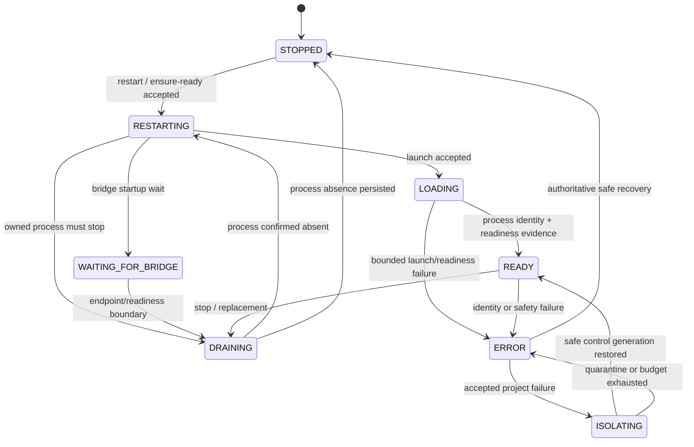

# DevBridge2 architecture

DevBridge2 is split into a transport-independent Coordinator Core, a small executable host, an
offline executable test suite, and two net472 components that are deliberately independent of the
net8 coordinator runtime.

```text
CLI / agents
    |
    | Coordinator IPC v2: request -> events* -> one terminal result
    v
Coordinator host (named pipe, current-user boundary, process startup)
    |
    v
Coordinator.Core (authoritative state, lifecycle, leases, persistence, recovery, routing)
    |                         |
    |                         +--> Runtime/state.json and immutable generation artifacts
    v
RimWorld process <---- readiness / process identity ---- DevBridge2 Mod (net472)
    |
    +---- optional loopback GABP ---- RimBridgeServer + optional BridgeTools companion
```

## Ownership and identity

One coordinator owns the configured coordinator root, its runtime slot, `Runtime/state.json`, leases,
the RimWorld process identity, accepted generations, and ModsConfig transitions. The executable host
serializes requests through a Windows named pipe restricted to the current user. A process cannot
become coordinator-owned merely by having the same PID: ownership requires the durable root/slot,
PID, process-start identity, launch ID, generation, and readiness evidence to agree.

The root path is canonicalized independently from opaque identifiers. The runtime slot is a stable
96-bit hash-derived ID; pipe and mutex names use the same canonical namespace rules. A persisted legacy
short slot is rejected with migration guidance rather than silently rebound. Full lease, registration,
scope-ticket, launch-key, and request identifiers are used for authorization and equality; short
prefixes are display-only.

Leases are durable, owner/session-bound records. The lease ID and stable agent identity authorize
renew/end/stop/ensure-ready operations. Connected test sessions renew only while connected. Expiry,
disconnect, and restart recovery never transfer authorization to another owner.

## IPC and command lifetime

The coordinator IPC contract is `devbridge-coordinator-ipc/v2`, sourced from
`DevBridgeSchemaVersions.CoordinatorProtocolMajor`. A request has a protocol version, request ID,
type, command, and bounded arguments. Events carry the same request ID and are distinct from a result.
Every finite accepted command produces exactly one terminal result. `wait-ready`, restart progress, and
test sessions may remain connected and emit events, but they still have explicit session semantics;
clients never wait for a magic substring in arbitrary output. Version, correlation, frame, command,
argument, and output limits are enforced before state mutation.

The RimBridge client has a separate typed GABP boundary. Its contract and tested surface are in
[`RimBridgeProtocolCompatibility.json`](../RimBridgeProtocolCompatibility.json): `gabp/1`, typed
`session/hello`, `tools/list`, `tools/call`, bounded Content-Length framing, exact response IDs, and
redacted error mappings. No live RimBridgeServer version is claimed without a local smoke test.

## Lifecycle and generations

The durable lifecycle state is represented by `STOPPED`, `RESTARTING`, `WAITING_FOR_BRIDGE`, `DRAINING`,
`LOADING`, `READY`, `ISOLATING`, and `ERROR`. The simplified transition graph is:



An accepted generation freezes the exact profile, ModsConfig fingerprints, project registrations,
launch identity, process evidence, and readiness evidence. Generation numbers never decrease. Accepted
history and manifests are immutable evidence; later STOPPED or failure records do not rewrite a
completed accepted generation. A replacement launch cannot silently consume another owner's lease or
replenish a finite launch/isolation budget.

## Durable state and authority boundaries

State and semantic history are written atomically under `Runtime`. Important artifacts include
`state.json`, baseline/generated ModsConfig records, generation manifests/history, readiness and
quicktest failure evidence, endpoint metadata, and bounded `coordinator-events.jsonl` diagnostics.
Writes use temporary files and replacement, and recovery distinguishes a missing write, a completed
replacement, and an ambiguous side effect. Diagnostic failures never trigger an unsafe fallback.

DevBridge is the sole authority for its generated `ModsConfig.xml`, accepted profiles, baselines,
generation ownership, and lifecycle. Unexpected external edits are recorded as evidence and fail closed;
the coordinator does not bless the changed bytes or enter an automatic restart loop. Explicit baseline
capture/restore and profile workflows are required to reconcile ownership.

RimWorld process control is identity-bound. PID alone is insufficient; process start identity, launch
ID, generation, configured root, and readiness evidence must match. If the census is ambiguous, the
coordinator preserves quarantine. A proven empty census may persist STOPPED, but a separate explicit
restart is required.

## Recovery and crash isolation

Coordinator restart loads durable state and resumes only operations whose safety evidence is complete.
Uncertainty never becomes permission to kill or launch. Fault boundaries around state writes, atomic
replacement, process actions, ModsConfig transitions, history/manifest writes, result writes, and
shutdown are tested with deterministic injection. Recovery is bounded and idempotent.

When a project failure is attributable and the accepted aggregate is safe to test, crash isolation
freezes the accepted evidence, tries bounded control-profile candidates, and restores the maximal safe
remainder. Control failures, stale process identity, ambiguous side effects, malformed failure data,
and exhausted budgets are environmental/quarantined outcomes, not invitations to retry indefinitely.

## RimBridge trust boundary and secrets

RimBridgeServer remains an optional live-game observation/control service. DevBridge routes only after
validating the current generation, process identity, loopback endpoint, policy, lease, and optional
companion identity. The companion is read-only and strengthens identity evidence; endpoint-only
operation remains valid when it is absent. The core Mod has no RimBridgeServer SDK dependency.

Tokens and authorization secrets are never persisted in ordinary state, status, doctor, provenance,
trace, or release manifests. Error text and opaque evidence use bounded redaction. Raw environment
variables, arbitrary tool payloads, and host SDK assemblies are not release diagnostics or package
inputs.

## Invariants for future changes

Future lifecycle, protocol, or packaging changes must preserve these properties:

- at most one accepted coordinator-owned RimWorld process exists for a runtime slot;
- `READY` implies accepted process identity and readiness evidence;
- `maintenanceReady` implies confirmed process absence;
- generation and immutable evidence do not move backward or mutate;
- unsafe/rejected operations perform no process or ModsConfig mutation;
- finite IPC commands have one correlated terminal result;
- restarts preserve uncertainty and never authorize an unsafe action;
- authorization uses complete durable identifiers, not display prefixes;
- secrets stay out of durable state, diagnostics, IPC projections, and packages;
- recovery, history, crash isolation, and release outputs remain bounded and reproducible.
